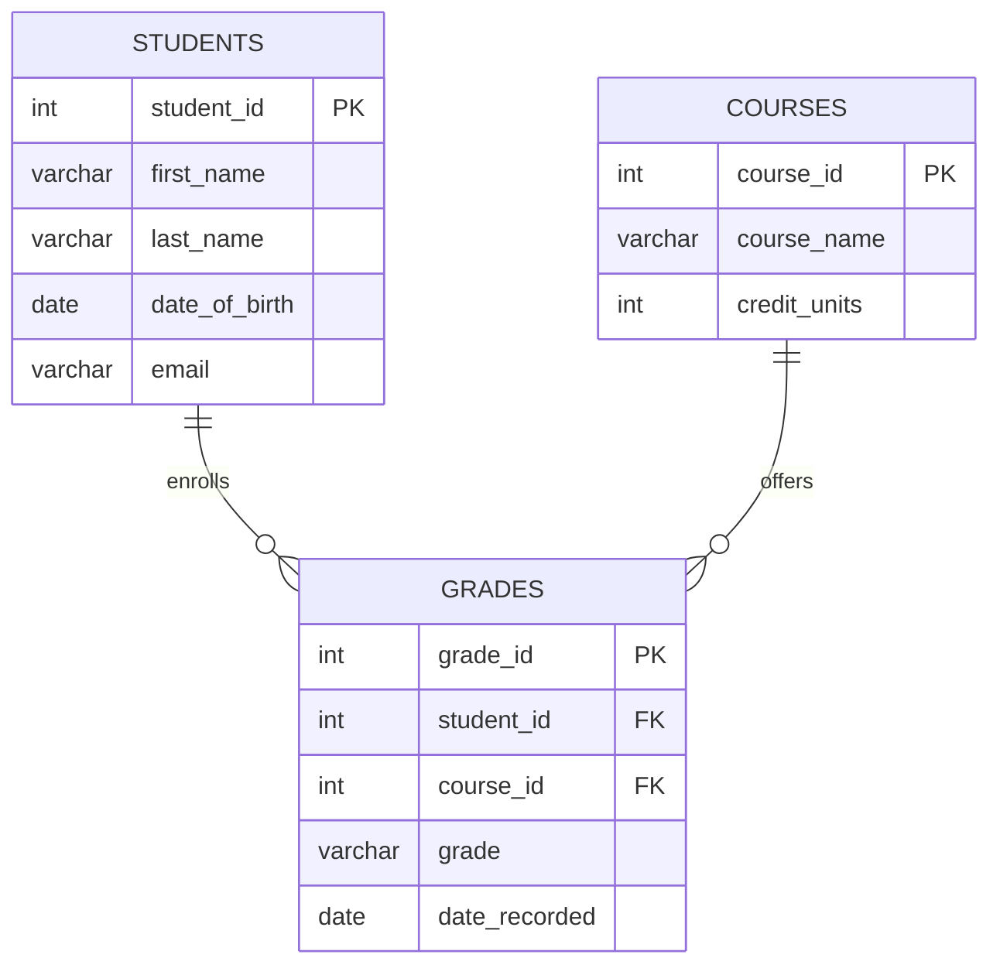

---

# 🎓 Student Records Management System (PostgreSQL + ERD)

A database-driven project designed to efficiently manage **student records, courses, and grades** using **PostgreSQL**. This project demonstrates **database design, normalization, SQL querying, and ERD documentation** for academic record management.

---

## 📌 Features

* ✅ **Normalized Database Schema** for students, courses, and grades
* ✅ **Relational Integrity** enforced through primary/foreign keys
* ✅ **SQL Queries** for data retrieval, reporting, and analytics
* ✅ **Entity Relationship Diagram (ERD)** documented using [dbdiagram.io](https://dbdiagram.io)
* ✅ **Scalable & Extensible** structure for additional entities (lecturers, departments, etc.)

---

## 🗄️ Database Design

The schema has been **normalized up to 3NF** to avoid redundancy and ensure data consistency.
It includes the following core entities:

* **Students** → stores student personal and enrollment details
* **Courses** → stores course information and credit units
* **Grades** → maintains relationships between students and courses with grading details

---

## 📊 Entity Relationship Diagram (ERD)

The ERD was created and documented using **dbdiagram.io** for a professional representation:

> *(Insert ERD image here — you can export from dbdiagram.io and add it as `erd.png` in your repo)*



---

## 🛠️ Technologies Used

* **Database:** PostgreSQL
* **ERD Tool:** dbdiagram.io
* **Query Language:** SQL

---

## 📂 Project Structure

```
student-records-management/
│── docs/
│   └── erd.png              # Exported ERD diagram
│── sql/
│   ├── schema.sql           # Database schema (tables + constraints)
│   ├── insert_data.sql      # Sample data population
│   └── queries.sql          # Example queries for reporting
│── README.md                # Project documentation
```

---

## 🚀 Getting Started

### 1️⃣ Clone Repository

```bash
git clone https://github.com/your-username/student-records-management.git
cd student-records-management
```

### 2️⃣ Set Up Database

```bash
psql -U your_username -d your_database -f sql/schema.sql
psql -U your_username -d your_database -f sql/insert_data.sql
```

### 3️⃣ Run Queries

```bash
psql -U your_username -d your_database -f sql/queries.sql
```

---

## 📈 Example Queries

* Get all students with their enrolled courses
* Calculate GPA per student
* Generate course performance reports

---

## 📜 License

This project is licensed under the **MIT License** – feel free to use, modify, and share.

---

## 👨‍💻 Author

**Engr. Ipaye**
🔗 [GitHub Profile](https://github.com/engripaye)

---

Would you like me to also **add real sample queries and reports** (like GPA calculation, top-performing students, etc.) to make your README more **practical and impressive**?
